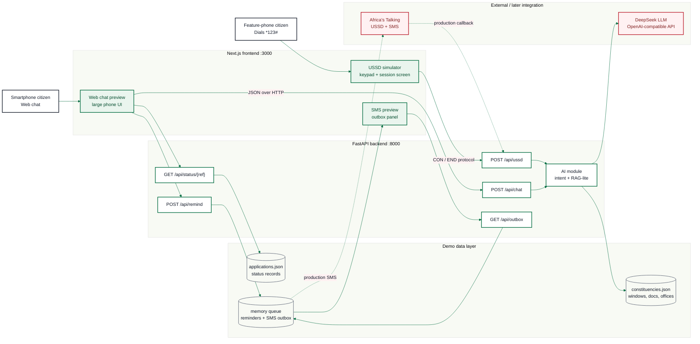
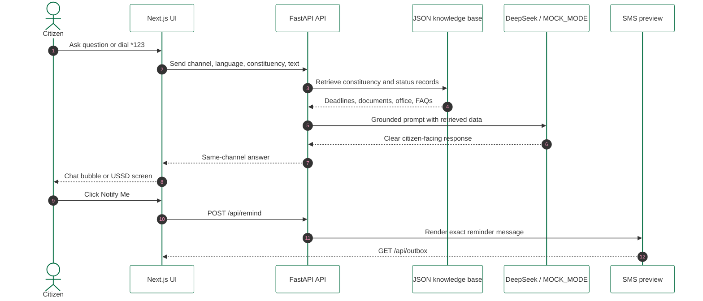
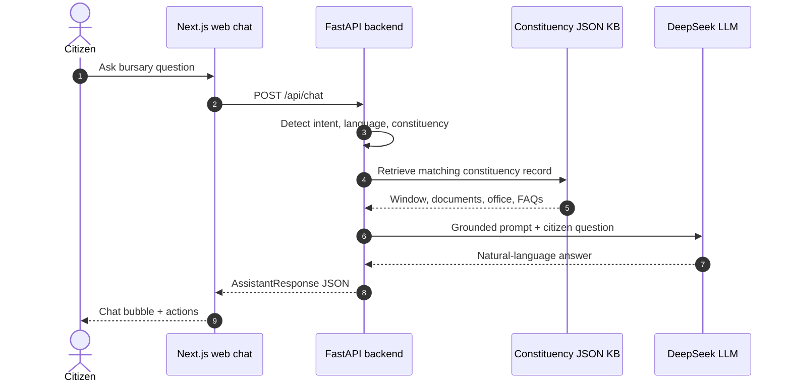
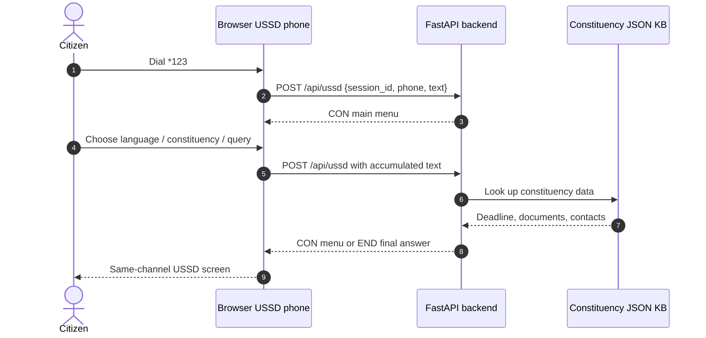
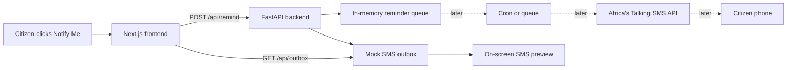
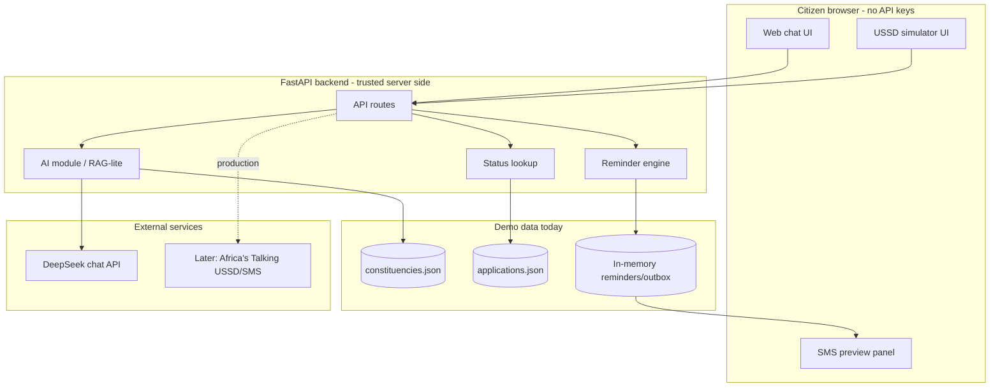

# Architecture & Data Schema — BursaBridge AI

> **Legend used throughout:** ✅ **Built today** (working code on D-Day) ·
> 🟡 **Mocked today** (simulated on-screen / mock data, real design exists) ·
> ⏩ **Built later** (post-hackathon roadmap)

---

## 1. End-to-End Architecture

The project is split into two apps: a **Next.js frontend** (UI/UX, port 3000)
and a **FastAPI backend** (API + AI module, port 8000). They talk over HTTP
(JSON); the frontend never holds the API key.

### Rendered system map



### Channel data flow



```
        CITIZEN CHANNELS                NEXT.JS FRONTEND (:3000)         FASTAPI BACKEND (:8000)                EXTERNAL
     (input = output channel)

 ┌───────────────────────────┐        ┌────────────────────────┐      ┌────────────────────────────┐
 │ ✅ Smartphone user        │───────►│ ✅ /      Web chat      │ HTTP │ ✅ POST /api/chat          │
 │    (web chat)             │◄───────│    (phone-frame UI,    │◄────►│ ✅ POST /api/ussd          │      ┌─────────────────┐
 ├───────────────────────────┤        │    processing steps,   │ JSON │ ✅ POST /api/remind        │HTTPS │ ✅ DeepSeek LLM │
 │ ✅ Feature-phone user     │───────►│    Notify Me button)   │      │ ✅ GET  /api/status/{ref}  │◄────►│  (chat API,     │
 │    (dials *123#)          │◄───────│ ✅ /ussd USSD simulator │      │ ✅ GET  /api/outbox        │      │  OpenAI-compat) │
 └───────────────────────────┘        │    (keypad, session    │      │            │               │      └─────────────────┘
   🟡 real telco USSD gateway         │    menus, 0 = back)    │      │            ▼               │
   ⏩ Africa's Talking USSD            └────────────────────────┘      │ ✅ AI MODULE (RAG-lite)    │
                                                                      │ 1. detect intent +         │
 ┌───────────────────────────┐                                        │    constituency            │
 │ 🟡 SMS delivery           │◄───rendered from /api/outbox───────────│ 2. retrieve KB record ────┐│
 │    (on-screen SMS outbox  │                                        │ 3. grounded prompt        ││
 │    shows the exact SMS    │                                        │ 4. DeepSeek call (or      ││
 │    that would be sent)    │                                        │    MOCK_MODE template)    ││
 └───────────────────────────┘                                        │ 5. format per channel     ││
   ⏩ Africa's Talking SMS                                             │                           ││
                                                                      │ ✅ Reminder engine        ││
                                                                      │ ✅ Status lookup          ││
                                                                      └───────────────────────────┘│
                                                                                    ▲              │
                                                                     ┌──────────────┴───────────┐  │
                                                                     │ 🟡 MOCK DATA (JSON)      │◄─┘
                                                                     │ data/constituencies.json │
                                                                     │ data/applications.json   │
                                                                     └──────────────────────────┘
                                                                      ⏩ committee admin portal +
                                                                        SQLite/Postgres feed this
```

**Flow (happy path):** parent types a question or dials `*123#` → frontend
sends it to the backend → backend detects intent and constituency → retrieves
that constituency's record from the knowledge base → sends question + record
to DeepSeek with a grounding system prompt → response is formatted for the
originating channel (rich chat bubble with buttons, or a short USSD screen)
→ returned **on the same channel**. "Notify Me" writes a `Reminder`; the
SMS outbox panel renders exactly the SMS that would be sent.

### Data-flow diagrams

These diagrams use **Mermaid**, which GitHub renders inside Markdown without
installing a frontend package. For the final pitch deck, the same Mermaid
blocks can also be pasted into Eraser for a cleaner visual export.

#### Web chat answer flow



#### USSD session flow



#### Reminder and SMS preview flow



#### Data stores and trust boundary



### How the USSD demo works (no telco needed)

The `/ussd` page is a **browser-based feature-phone simulator**: the user
"dials" `*123#` on an on-screen keypad, and every menu selection posts to
`POST /api/ussd` with the same request shape a real USSD gateway (e.g.
Africa's Talking) sends — `{ session_id, phone, text }`, where `text` is the
accumulated selection path like `"1*1"`. The backend replies
`CON <menu>` (session continues) or `END <message>` (session ends), which is
the real USSD protocol. **The code path is production-shaped end to end —
only the telco gateway itself is simulated**, because the hackathon requires
everything on localhost (a real gateway needs a publicly hosted callback URL).
Going live later means registering a service code with Africa's Talking and
pointing it at this same endpoint — no logic changes.

---

## 2. Component Status Matrix

| # | Component | D-Day status | Notes / later plan |
|---|-----------|:---:|---|
| 1 | Web chat UI (Next.js, phone-frame, processing animation) | ✅ Built | `frontend/app/page.tsx` |
| 2 | USSD simulator UI (keypad phone, `*123#`, session menus) | ✅ Built | `frontend/app/ussd/page.tsx` |
| 3 | FastAPI backend (`/api/chat`, `/api/ussd`, `/api/remind`, `/api/status`, `/api/outbox`) | ✅ Built | `backend/main.py`, port 8000 |
| 4 | AI module: intent + retrieval + DeepSeek call (RAG-lite) | ✅ Built | Real API call to DeepSeek; grounded on KB |
| 5 | `MOCK_MODE` offline fallback for the AI module | ✅ Built | Demo-day insurance if venue internet fails |
| 6 | Reminder engine (create reminder, render SMS to outbox) | ✅ Built | In-memory store today |
| 7 | Application status lookup by reference number | ✅ Built | Reads mock records |
| 8 | Kiswahili / English support | ✅ Built | LLM system prompt + USSD Language menu |
| 9 | Constituency knowledge base | 🟡 Mocked | Hand-written JSON for 5 constituencies (Ol-Kalou, Mwala, Garissa Township, Kieni, Mathira); later fed by committees |
| 10 | Application status records | 🟡 Mocked | Sample records in JSON; later synced from committee workflow |
| 11 | SMS delivery | 🟡 Mocked | On-screen SMS outbox; later Africa's Talking SMS API |
| 12 | USSD gateway (real `*123#` over telco) | 🟡 Mocked | Browser simulator speaking the real CON/END protocol; later Africa's Talking USSD |
| 13 | Committee admin dashboard (applications overview, statuses, analytics) | ⏩ Later | Designed in the mockup; deliberately cut from the D-Day demo to keep scope on citizen access |
| 14 | Persistent database (SQLite → Postgres) | ⏩ Later | Demo uses JSON + in-memory |
| 15 | Scheduled reminder dispatch (cron/queue) | ⏩ Later | Demo creates the reminder and shows the rendered SMS immediately |
| 16 | Direct SMS Q&A channel (question in, answer out over SMS) | ⏩ Later | Same AI module, Africa's Talking inbound SMS |
| 17 | Data-protection hardening (encryption at rest, consent flows, DPA 2019 compliance) | ⏩ Later | Demo stores no real personal data |
| 18 | Vernacular language support beyond Kiswahili | ⏩ Later | |

---

## 3. Core Data Schemas

### 3.1 `CitizenQuery` — input object (web chat)

```json
{
  "channel": "web",
  "session_id": "a1b2c3",
  "language": "en",                    // "en" | "sw"
  "constituency": "ol-kalou",
  "text": "When does Ol-Kalou bursary open?"
}
```

### 3.2 `UssdRequest` — input object (USSD; same shape a real gateway sends)

```json
{
  "session_id": "ATUid_9f2b",
  "phone": "+254712345678",
  "text": "1*1"                        // accumulated keypresses: menu 1 → constituency 1
}
```

The USSD response is plain text prefixed with `CON` (show menu, keep session)
or `END` (final screen), exactly as Africa's Talking expects.

### 3.3 `AssistantResponse` — output object (web chat)

```json
{
  "session_id": "a1b2c3",
  "intent": "deadline_query",          // deadline_query | documents | status | faq | contact | eligibility
  "answer": "Ol-Kalou NG-CDF bursary applications open on 12 July 2026.",
  "details": {
    "opens": "2026-07-12",
    "closes": "2026-07-25",
    "required_documents": ["Admission Letter", "Fee Structure", "Chief Recommendation", "National ID (Guardian)"]
  },
  "source": "deepseek+kb",             // "deepseek+kb" | "kb_only (MOCK_MODE)"
  "actions": ["notify_me", "check_status"],
  "language": "en"
}
```

### 3.4 `ConstituencyRecord` — knowledge-base entry (`backend/data/constituencies.json`)

```json
{
  "id": "ol-kalou",
  "name": "Ol-Kalou",
  "county": "Nyandarua",
  "bursary_window": { "opens": "2026-07-12", "closes": "2026-07-25" },
  "required_documents": [
    "Admission Letter",
    "Fee Structure",
    "Chief Recommendation",
    "National ID (Guardian)"
  ],
  "eligibility_notes": "Secondary and tertiary students; priority to orphans and low-income households.",
  "office": { "location": "Ol Kalou town, opposite sub-county offices", "phone": "+254700000001", "hours": "Mon–Fri 8:00–16:00" },
  "faqs": [
    { "q": "Can a student studying outside the county apply?", "a": "Yes, through a parent or guardian resident in the constituency." }
  ]
}
```

### 3.5 `Reminder` — created by "Notify Me" (`POST /api/remind`)

```json
{
  "id": "rem_004",
  "phone": "+254712345678",
  "constituency": "ol-kalou",
  "event": "window_opens",             // window_opens | window_closes | status_change
  "send_at": "2026-07-10T08:00:00+03:00",
  "channel": "sms",
  "status": "queued",                  // queued | sent (mock renders it to the SMS outbox)
  "message": "Hello! This is a reminder from BursaBridge. Ol-Kalou NG-CDF bursary applications open on 12 July 2026. For help, dial *123#"
}
```

### 3.6 `ApplicationStatus` — status lookup (`backend/data/applications.json`)

```json
{
  "ref_no": "OKL-2026-0142",
  "constituency": "ol-kalou",
  "stage": "review_in_progress",       // received | review_in_progress | ready_for_collection | collected
  "submitted_at": "2026-07-14",
  "estimated_completion_days": 7,
  "public_note": "Application received and under committee review."
}
```

> **Privacy note:** the citizen-facing status lookup exposes no names, scores,
> or amounts — only a reference number and workflow stage. The AI never reads
> household financial data and never ranks applicants. Named application
> records exist only in the ⏩ committee dashboard, visible to authorised
> officers.

---

## 4. Tech Stack (D-Day)

| Layer | Choice | Why |
|---|---|---|
| Frontend | **Next.js (App Router) + TypeScript + Tailwind CSS**, port 3000 | Clean separation of UI/UX from backend; fast to build the phone-frame chat, USSD simulator, and SMS outbox as components |
| Backend | **Python 3.10+ · FastAPI + Uvicorn**, port 8000 | Matches the organisers' Python template; async; CORS-enabled for localhost:3000 |
| AI module | **DeepSeek chat API** via the `openai` Python SDK (`base_url=https://api.deepseek.com`) | DeepSeek is OpenAI-compatible; organisers provided the token; key stays server-side |
| Retrieval | Keyword/ID lookup over `backend/data/constituencies.json` injected into the prompt (RAG-lite) | 5 mock constituencies don't need a vector DB; keeps the demo debuggable |
| SMS | Mocked on-screen outbox (`GET /api/outbox`) | Hackathon rule: nothing hosted; Africa's Talking is the ⏩ later path |
| USSD | Browser simulator speaking the real `CON`/`END` protocol against `POST /api/ussd` | Production-shaped code path; only the telco gateway is simulated |
| Secrets | `backend/.env` via `python-dotenv`; gitignored, `.env.example` committed | Organisers' requirement — the API key never reaches GitHub or the browser |
| Resilience | `MOCK_MODE=true` env flag | Full demo works with no internet/API — venue-proof |

---

*Part of the Mozilla Foundation × KamiLimu Democracy & AI Hackathon — July 4th, 2026*
